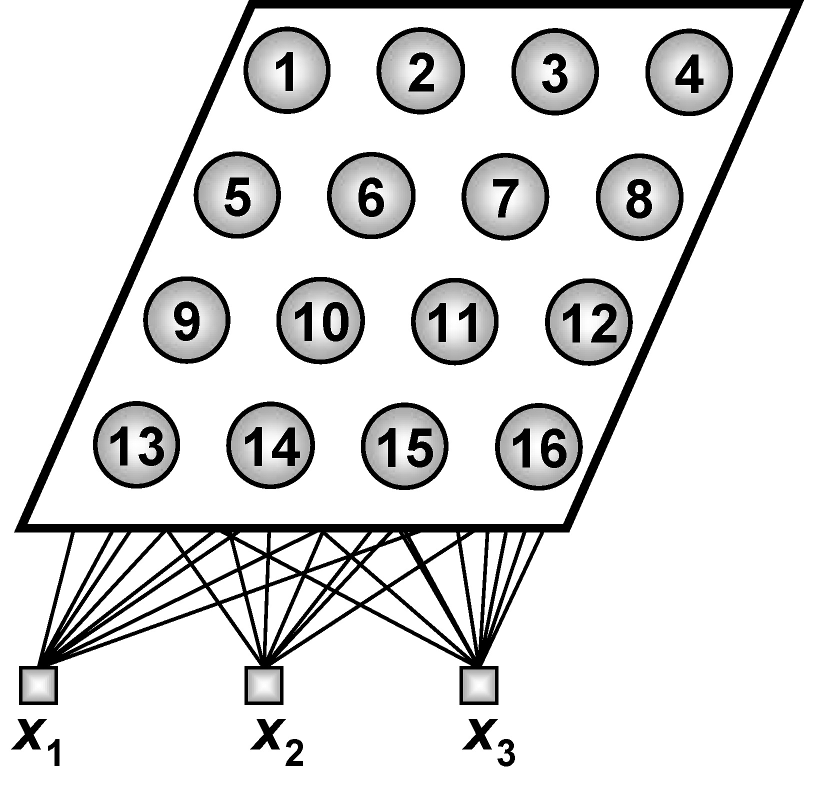

<h1>redeKohonen</h1>

Implementação da Rede Neural de Kohonen proposta no Projeto prático 8.5 do livro "Redes Neurais Arficiais para engenharia e ciências aplicadas" do autor Ivan Nunes da Silva.

<h4>
Aluno: Jônatas Trabuco Belotti 
Email: jonatas.t.belotti@hotmail.com
</h4>

<h2>Arquitetura da rede</h2>

A rede possui 3 entradas entradas e 16 neurônios em sua única camada neural.
Conforme a imagem a seguir.

<h2>Arquivos</h2>

Os arquivos do repositórios são:

<b>Pasta "Dados" - </b> Contém um exemplo de arquivo para ser utilizado no treinamento da rede (arquivo "Dados treinamento.txt") e um exemplo de arquiv para ser utilizado na execução da rede (arquivo "Dados teste.txt").

<b>Pasta "redeKohonen" - </b> Contém o projeto do NetBeans com a implementação da rede de Kohonen em Java.

<b>Arquivo "redeKohonen.exe" - </b> Arquivo executavel da rede para ser executado em Windows.

<b>Arquivo "redeKohonen.jar" - </b> JAR da rede para ser executado em linux ou Windows.

<b>Arquivo "Relatorio.pdf" - </b> Arquivo PDF contendo o relatório entregue para a diciplina.

<b>Atenção - </b> para executar os arquivos "redeKohonen.jar" ou "redeKohonen.exe" é necessário ter o <a target="_blank" href="https://www.java.com/pt_BR/download/">Java JRE</a> ou <a target="_blank" href="http://www.oracle.com/technetwork/pt/java/javase/downloads/index.html">Java JDK</a> instalado em seu computador.
